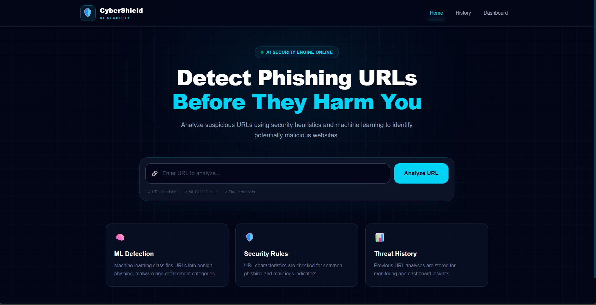
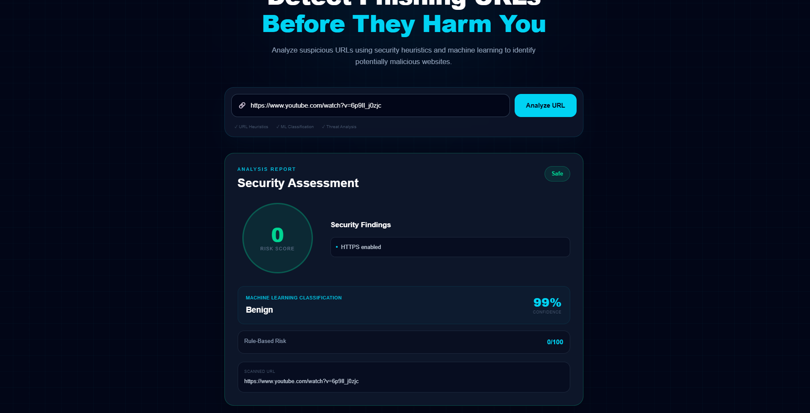
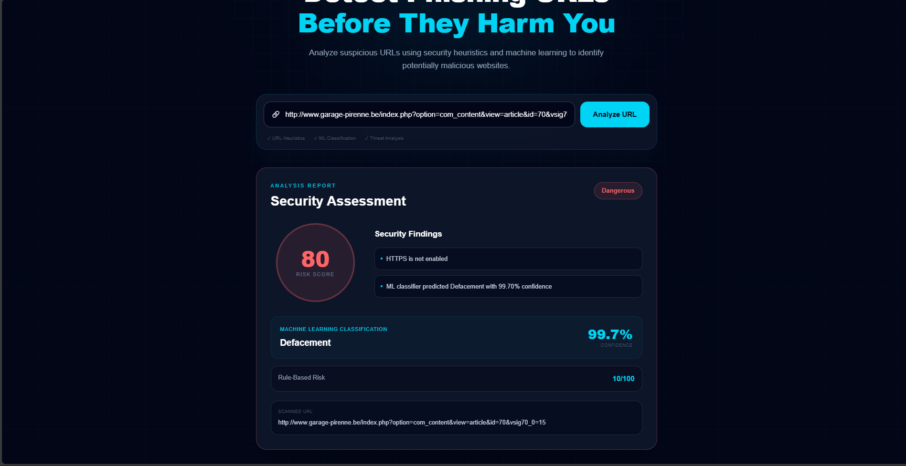
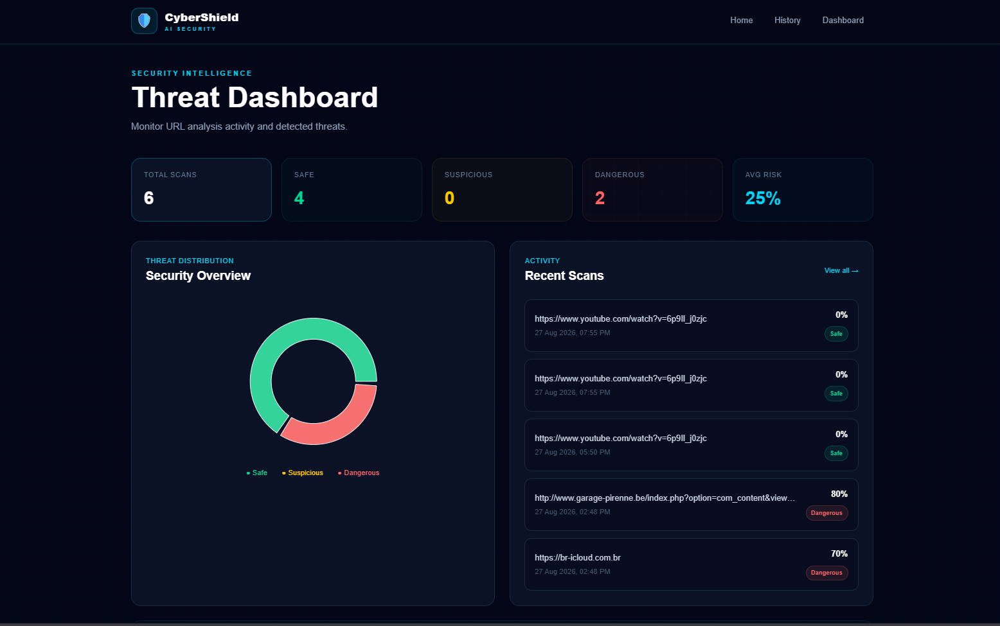

# CyberShield AI

## AI-Based Malicious URL Detection System

CyberShield AI is a web-based security application that analyzes URLs and identifies potentially malicious websites using a combination of **rule-based security analysis** and **machine learning classification**.

The system classifies URLs into four categories:

- Benign
- Phishing
- Malware
- Defacement

It also generates a risk score, confidence level, security findings, scan history, and dashboard statistics.

---

## Features

- URL security analysis
- Rule-based URL inspection
- Machine learning based classification
- Four-class URL classification
- Risk score generation
- ML confidence score
- Security findings and explanations
- Scan history
- Dashboard with scan statistics
- React-based user interface
- Flask REST API

---

## Screenshots

### Home - URL Scanner


### Safe URL Analysis


### Malicious URL Detection


### Dashboard


---

## System Architecture

```text
                    User
                     |
                     v
              React Frontend
                     |
                     v
               Flask REST API
                     |
          +----------+----------+
          |                     |
          v                     v
   Rule-Based Analysis     ML Classifier
          |                     |
          |              TF-IDF Features
          |                     |
          |              Logistic Regression
          |                     |
          +----------+----------+
                     |
                     v
              Risk Assessment
                     |
          +----------+----------+
          |                     |
          v                     v
       Result                SQLite DB
                              |
                       +------+------+
                       |             |
                       v             v
                    History      Dashboard


